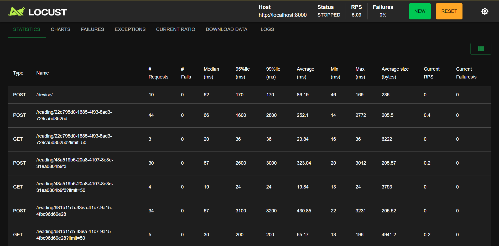
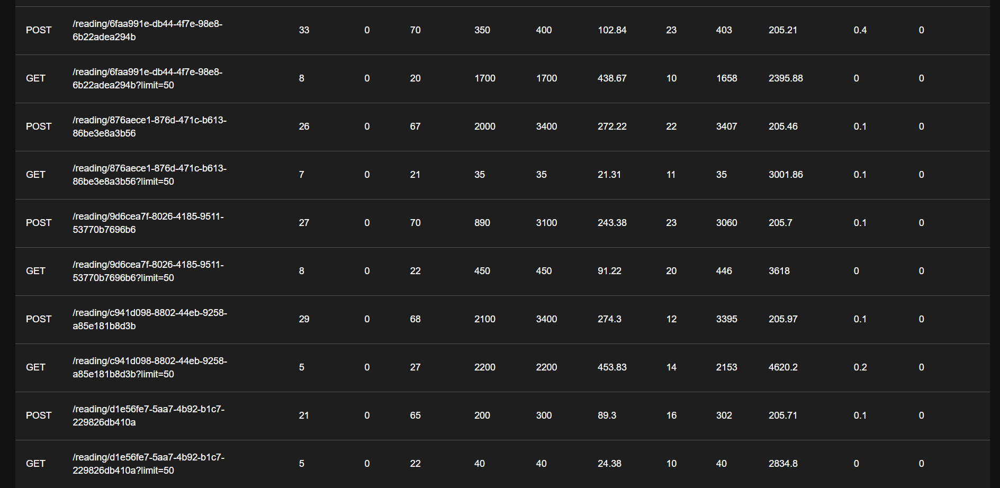
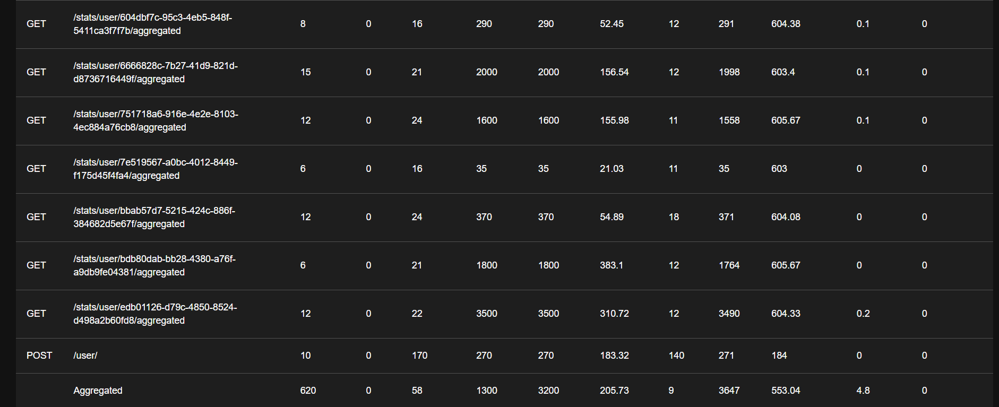
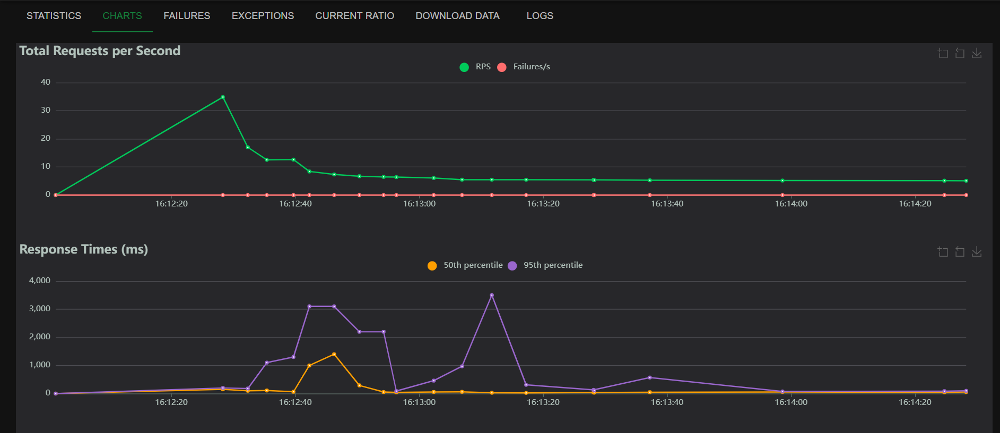

# Device Statistics Service

Сервис для сбора и анализа статистики с устройств. Реализован на FastAPI с использованием PostgreSQL, SQLAlchemy, Pydantic.

## Технологии

- Python 3.11+
- FastAPI
- SQLAlchemy 2.0 (async)
- PostgreSQL
- Pydantic
- Ruff (линтер)
- docker-compose

## Функционал

### Пользователи (User)

| Метод | Эндпоинт | Описание |
|-------|----------|----------|
| POST | `/user/` | Создание пользователя |
| GET | `/user/{user_id}` | Получение пользователя по ID |

### Устройства (Device)

| Метод | Эндпоинт | Описание |
|-------|----------|----------|
| POST | `/device/` | Создание устройства (привязка к пользователю) |
| GET | `/device/{device_id}` | Получение устройства по ID |
| GET | `/device/user/{user_id}/devices` | Список всех устройств пользователя |

### Показания (Reading)

| Метод | Эндпоинт | Описание |
|-------|----------|----------|
| POST | `/reading/{device_id}` | Добавление показаний (x, y, z) |
| GET | `/reading/{device_id}` | Получение истории показаний с фильтрацией по дате |

### Статистика (Statistics)

| Метод | Эндпоинт | Описание |
|-------|----------|----------|
| GET | `/stats/device/{device_id}` | Статистика по устройству (min/max/count/sum/median) |
| GET | `/stats/user/{user_id}/aggregated` | Агрегированная статистика по всем устройствам пользователя |

**Параметры статистики:**
- `min_value` - минимальное значение (x, y, z)
- `max_value` - максимальное значение
- `readings_amount` - количество показаний (записей в БД)
- `sum_value` - сумма всех значений
- `median` - медиана

Проект использует **Ruff** - быстрый линтер и форматтер для Python.

```ruff check``` - проверка на текущие ошибки и их быстрое исправление
```ruff format``` - автоматическое форматирование файлов кода

Настроен .pre-commit - перед каждым коммитом идет локальная проверка на соответствие установленным правилам (форматирование и проверка ошибок стилистики)

Настроено логирование с кастомной конфигурацией. Уровни: DEBUG, INFO, WARNING, ERROR

Используется асинхронный движок для взаимодействия с БД

## Дополнительные возможности

### Автоматическое обновление времени активности

| Поле | Где обновляется | Когда |
|------|----------------|-------|
| `users.last_used` | В сервисах | При запросе пользователя, его устройств или статистики |
| `devices.last_reading_at` | `ReadingService.create_reading` | При добавлении нового показания |

Обновление last_used: вызывается в сценариях, требующих непосредственно получения пользователя (и его id для внутренних операций), а также в случаях получения статистики пользователя
Обновление last_created_at: получение новых показаний


### Медиана

Рассчитывается на чистом Python без внешних зависимостей:

- Чётное количество значений: среднее арифметическое двух центральных
- Нечётное количество: центральное значение

## О проекте

Сервис предназначен для систем, где устройства регулярно отправляют телеметрию / данные (в данном случае - три значения: x, y, z).

**Ключевые возможности:**
- Хранение истории показаний с привязкой к устройству и временной метке
- Анализ данных за любой период (мин, макс, сумма, количество, медиана)
- Агрегация по пользователю — общая статистика по всем его устройствам
- Автоматическое отслеживание последней активности пользователя и устройства

## Особенности реализации

- **Асинхронность** — все операции с БД выполняются асинхронно (не блокируют сервер)
- **Трёхслойная архитектура** — Router -> Service -> Repository (чистое разделение ответственности)
- **Автоматическая документация** — Swagger UI доступен по `/docs`
- **Логирование** — структурированные логи с контекстом (метод, сервис, ID сущности)

## Результаты нагрузочного тестирования (Locust)

### Конфигурация теста

- **Виртуальные пользователи:** 10
- **Время разгона:** 5 секунд
- **Длительность теста:** ~2 минуты
- **Целевой хост:** `http://localhost:8000`

### Общие результаты

| Показатель                  | Значение |
|-----------------------------|----------|
| **RPS**             | ~5       |
| **Ошибки**                  | 0%       |
| **Медиана времени ответа**  | 58 ms    |
| **95-й процентиль**         | 1300 ms  |
| **Минимальное время ответа** | 9 ms     |
| **Максимальное время ответа** | 3647 ms  |

### Графики производительности









### Выводы

Большинство запросов работает быстро, сервис стабилен, эндпоинты не упали.
Есть выбросы в статистике (большое время ответа от сервера),
но в целом сервер выдерживает нагрузку и готов к эксплуатации с возможным масштабированием.

Сервис **успешно прошёл нагрузочное тестирование**:
- **0% ошибок**
- Производительность: **до 6 RPS** при 10 пользователях
- Основные эндпоинты работают достаточно быстро (медиана < 100 мс)

## Запуск приложения через Docker

### Требования

- Docker
- Docker Compose

### Настройка

1. Скопируйте (и отредактируйте при необходимости) файл с переменными окружения:

```bash
cp .env.example .env
```

DB_NAME - Имя базы данных

DB_USER - Пользователь БД

DB_PASSWORD - Пароль

DB_HOST - Хост

DB_PORT - Порт

DOCKER_HOST=postgres (Для Docker, имя сервиса в docker-compose)


2. Запуск

```
docker-compose up --build
```
